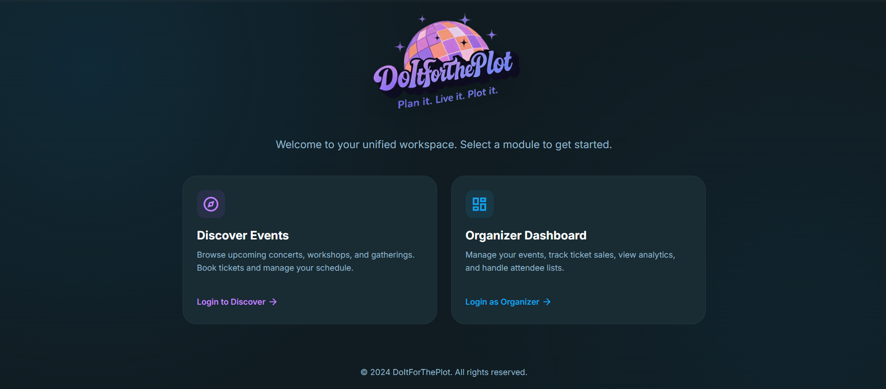

# DoItForThePlot 🎟️

A Semester 4 group project — an Event Management Web Application designed to help users discover events, manage registrations, and provide organizers with tools to handle event activities.

## 🚀 Live Demo

https://doitfortheplot.vercel.app/

## 📌 Overview

DoItForThePlot is a web-based event management platform that provides a simple interface for users and organizers.

Users can explore available events and access event-related features, while organizers can manage events through a dedicated dashboard interface.

This project was developed as a group project during Semester 4.

## ✨ Features

* User-friendly event browsing interface
* Organizer dashboard
* Event management features
* QR-based ticket entry system
* User authentication
* Responsive web pages
* Database integration

## 🛠️ Tech Stack

### Frontend

* HTML
* CSS
* JavaScript

### Backend

* Node.js
* PHP

### Database

* MySQL

### Development Tools

* Visual Studio Code
* Localhost development environment

### Supported Platforms

* Windows
* Linux
* macOS

### Supported Browsers

* Google Chrome
* Mozilla Firefox
* Modern web browsers

## 👨‍💻 My Contribution

As a frontend developer in the team, my main contributions included:

* Designing and developing frontend interfaces
* Creating user-facing web pages
* Improving UI structure and layout
* Implementing frontend interactions using JavaScript
* Assisting with testing and debugging of the application

## 📷 Screenshots



## 📂 Project Structure

```
DoItForThePlot
│
├── assets/
├── js/
├── auth.html
├── index.html
├── server.js
└── vercel.json
```

## 🔮 Future Improvements

* Improved UI/UX design
* Better event filtering and search
* Enhanced authentication system
* Cloud database integration
* Mobile-friendly improvements

## 👥 Project Type

Semester 4 Group Project

Developed collaboratively as part of academic coursework.
